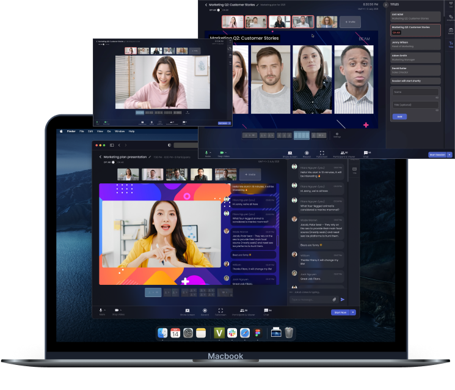
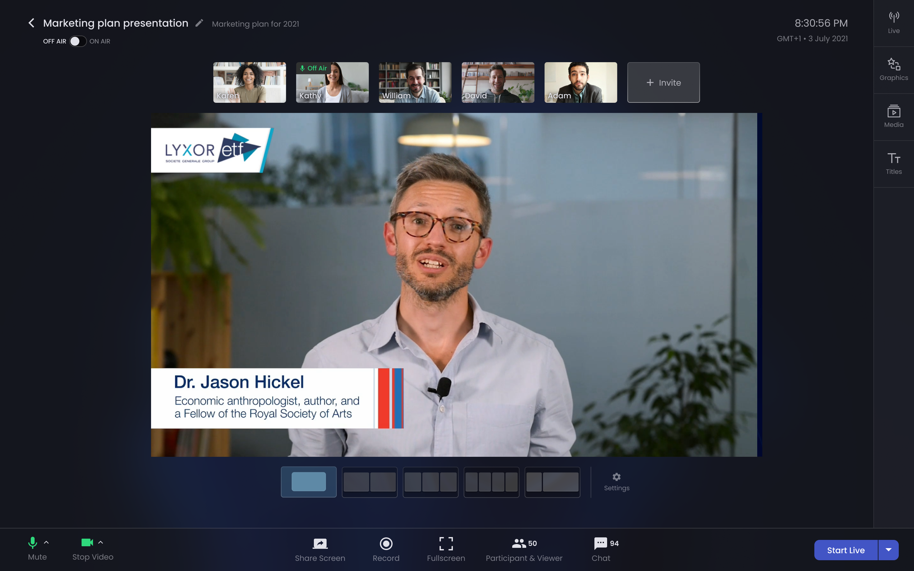
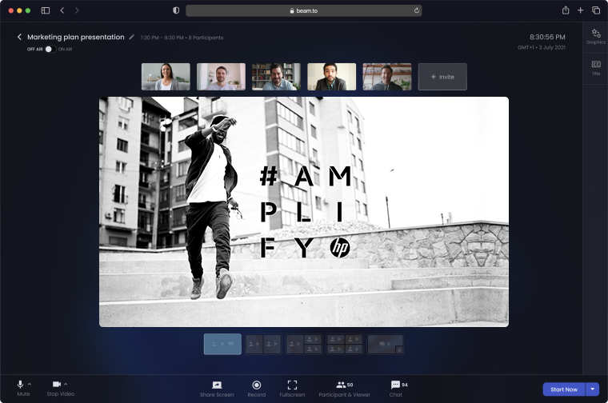
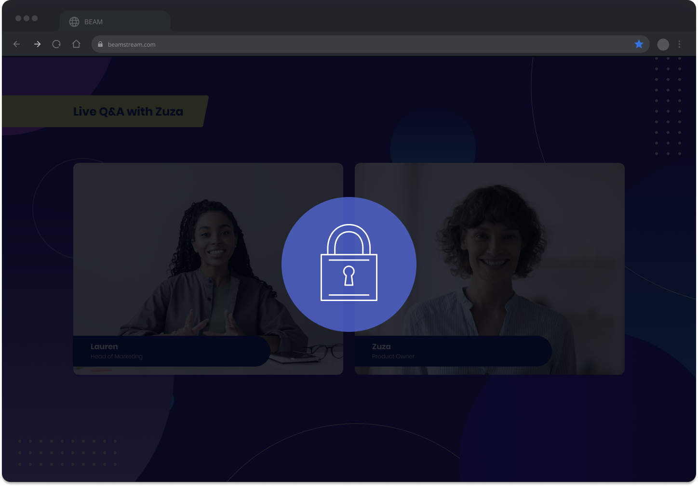

FEATURES

# Professional live streaming for B2B marketers

A powerful, reliable streaming tool that gives you the control of a broadcast expert. No experience necessary.

[Start your free trial](https://go.beings.com)

<iframe src="https://player.vimeo.com/video/652806323?h=42efa43eda&amp;badge=0&amp;autoplay=1&amp;loop=1&amp;autopause=0&amp;player_id=0&amp;app_id=58479&amp;muted=1" frameborder="0" allow="autoplay; fullscreen; picture-in-picture" allowfullscreen style="position:absolute;top:0;left:0;width:100%;height:100%;" title="BEAM"></iframe>

## Three steps to a professional live stream​

### 1\. Connect

Connect to your desired video platform

### 2\. Brand

Personalise backgrounds, logos, colours and titles. Invite your guests.

### 3\. Stream

That's it! You're ready to go - broadcast live and welcome your audience.

## Don't keep your audience waiting

A host of powerful yet accessible features allow you to focus on what matters: connecting with your audience

### Make your audience part of the conversation

Share your screen with your audience; highlight key information, add detail to presentations and create a fuller, more engaging experience for your viewers.

### Content that's unique to your brand

On-screen graphics, titles and media are fully customisable. What your audience sees on screen is a slick brand experience that could only have come from your company.

### Never lose a recording again

Upload pre-recorded videos or record in-app, your content is safe in secure cloud storage. Store recordings for future use and keep track of media you use for streaming, all in one place. 

### Stream live, wherever your audience is

Connect to corporate destinations such as Zoom, Teams, Google Meet and more. Prefer to stream to social media? No problem, live stream to popular platforms at the same time.

### Meet your audience where they are

Live stream to any platform that supports RTMP; Beam connects you with your audience where they like to hang out. That makes their life easier and means you can still deliver your message.

### Chat with participants mid-broadcast

Send and receive messages privately in the participants’ chat, perfect if your guest had technical difficulties or you need to change direction live on air. Eradicate awkward moments and ensure your show runs smoothly.

[Sign up for first access](https://go.beings.com) 

## Impress your audience, stand out from the crowd

Quality video content that creates a lasting impression

Customers and employees expect the best from trusted brands. Whether you’re looking to launch a new product or retain talent, the right impression matters. It’s the difference between whether people are engaged in your content or not – and whether they keep coming back. 

## Create brand experiences, exceed expectations

Full control of your live streaming output

Don’t just stream video, give audiences an experience with your brand. Customise brand colours, insert logos, add branded backgrounds and graphics, and include pre-recorded videos in just a few clicks.

 

## Secure by default

No software downloads or updates required

Beam runs completely in your browser; no need to download anything and risk your organisation’s security. And no annoying updates right before you go live: if you’re ready to live stream, we’re ready for you.

## Frequently asked questions

What is live streaming?

Live streaming, also known as ‘streaming’, is the act of broadcasting video or other media over the internet, in real time. The concept is similar to broadcasting live television.

What do businesses use live streaming for?

Live streaming is a great way for businesses to boost brand awareness and enhance employee engagement. It’s also used as a platform to connect with new audiences. Live streaming allows a business to meet customers or employees ‘where they are’ without needing to entice anyone to a physical event, for example. Live-streamed content can also be repurposed into marketing collateral, video on demand (VOD) content, or even edited into short snippets for use in social media posts.

What are the benefits of live streaming for a business?

When live streaming, the on-screen action happens in real time. A live broadcast means there is nowhere for the presenters or interviewees to hide. This immediacy helps to build a brand’s trust and credibility. Live video also allows an audience to get to know a business, presenter or employee. This enhances the relationship between the brand and the audience and boosts engagement with content. 

Who can use BEAM for live streaming?

Anyone can use Beam! It’s so easy, you can live stream without any experience. There are a few people in particular that will find Beam super useful: 

- Brands and businesses, from tech start-ups to multinational corporations
- Marketing professionals who are responsible for those brands
- Event managers running online and hybrid events
- Social media content creators

Can you use BEAM for free?

Yes! Beam offers a selection of its features on a free 14-day trial. To start live streaming today, click here.

## Try Beam today.

Live video that helps you grow

[Get started for free](https://go.beings.com)
