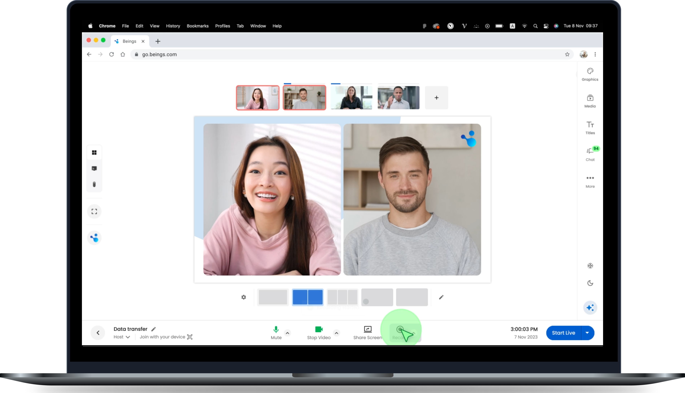
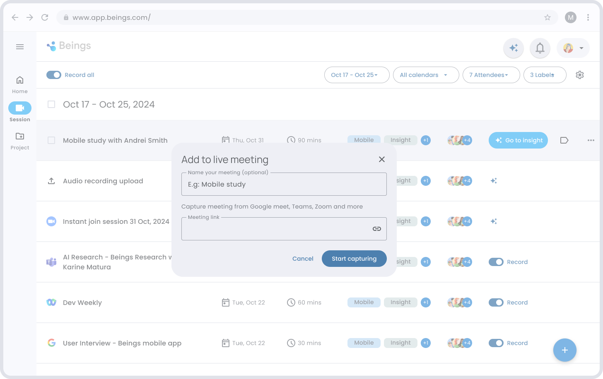
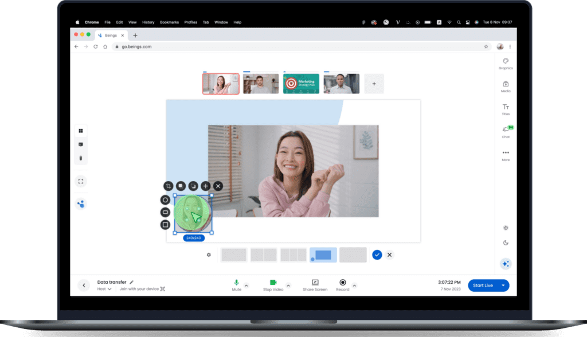
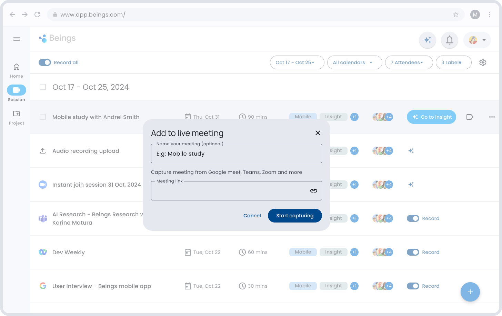

###### Study in the Lab

# More impactful moderated research

##### Move beyond the limitations of standard video conferencing tools and unlock a new level of research quality and depth with the Lab.  
  
Capture the nuance and detail of every meaningful interaction during your moderated research sessions, leading to richer insights and more impactful outcomes.

[Start Strong with Aida](https://beings.com/contact/) 

Elevate with AI

## See how to scale your message through engaging video storytelling

Amet convallis tempus lobortis dui. Nec dapibus pharetra ipsum commodo tristique viverra. [Start with Aida](#) 

###### Helpful resources

## Education tools to improve your knowledge

Access over 200 interactive financial education lessons covering a broad spectrum of topics from basic investing to advanced financial strategies, taught by experts  

###### Helpful resources

## Education tools to improve your knowledge

Access over 200 interactive financial education lessons covering a broad spectrum of topics from basic investing to advanced financial strategies, taught by experts

Elevate with AI

## See how to scale your message through engaging video storytelling

Amet convallis tempus lobortis dui. Nec dapibus pharetra ipsum commodo tristique viverra. [Start with Aida](#) 

###### Benefits

## Maximize your email marketing success

Drive engagement with advanced segmentation, automate effortlessly, and gain insightful analytics to make data-driven decisions

##### Increased Engagement

Use advanced segmentation and personalization to send the right messages to the right audience at the right time.

##### Automation

Automate your email campaigns, customer follow-ups, and responses to ensure timely communication without lifting a finger.

##### Analytics and Reporting

Gain deep insights into your campaign performance with our comprehensive analytics dashboard that helps you make data-driven decisions.

## Frequently asked questions

What is live streaming?

Live streaming, also known as ‘streaming’, is the act of broadcasting video or other media over the internet, in real time. The concept is similar to broadcasting live television.

What do businesses use live streaming for?

Live streaming is a great way for businesses to boost brand awareness and enhance employee engagement. It’s also used as a platform to connect with new audiences. Live streaming allows a business to meet customers or employees ‘where they are’ without needing to entice anyone to a physical event, for example. Live-streamed content can also be repurposed into marketing collateral, video on demand (VOD) content, or even edited into short snippets for use in social media posts.

What are the benefits of live streaming for a business?

When live streaming, the on-screen action happens in real time. A live broadcast means there is nowhere for the presenters or interviewees to hide. This immediacy helps to build a brand’s trust and credibility. Live video also allows an audience to get to know a business, presenter or employee. This enhances the relationship between the brand and the audience and boosts engagement with content. 

Who can use BEAM for live streaming?

Anyone can use Beam! It’s so easy, you can live stream without any experience. There are a few people in particular that will find Beam super useful: 

- Brands and businesses, from tech start-ups to multinational corporations
- Marketing professionals who are responsible for those brands
- Event managers running online and hybrid events
- Social media content creators

Can you use BEAM for free?

Yes! Beam offers a selection of its features on a free 14-day trial. To start live streaming today, click here.
