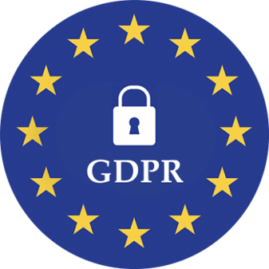
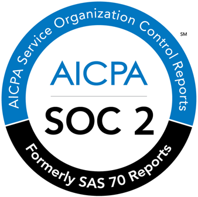

Aida

# Meet Aida

#### Your AI-Powered Research Assistant

From preparation to analysis, I’m here to save your team time, deliver exceptional insights, and help your agency impress and retain clients.

Let’s make your projects easier, your team more efficient, and your clients happier.

[Get started](https://beings.com/contact/) 

## Who Am I

Hi! I’m Aida, your AI-powered research partner! I’m excited to help you make your qualitative research faster, easier, and more accurate.

Think of me as your detail-loving, unbiased teammate who’s always ready to step in and help.

I handle everything from planning research goals to recruiting participants, transcribing data, and delivering insights. I'm here to keep things on track and stress-free.

 Need me in the background, quietly handling the admin? I’ve got you. Want me front and centre, helping facilitate calls or uncovering patterns? I’m there, too. I adapt to whatever you need to make your research process seamless and successful.

[Ready To Meet Aida?](https://beings.com/contact/) 

Quite simply, I don’t know how our agency managed without Aida. She takes green researchers and has them running projects like seasoned pros

## How Can I Help?

While I can’t make the tea, I can help in many other ways!

Here’s how I can support your qualitative research process:

## Preparation

I handle the groundwork, from defining research goals to recruiting participants. You can focus on your clients while I ensure the project starts strong. I remove bias from the beginning, ensuring that everything is built on solid foundations.

## Facilitating Calls

I join your sessions virtually, offering real-time prompts. I will guide you through the conversation as much as you need me to while maintaining that all-important objectivity and ensuring best practices and consistency across all calls.

## Transcription & Analysis

I handle the groundwork, from defining research goals to recruiting participants. You can focus on your clients while I ensure the project starts strong. I remove bias from the beginning, ensuring that everything is built on solid foundations.

## Insight Delivery

I join your sessions virtually, offering real-time prompts. I will guide you through the conversation as much as you need me to while maintaining that all-important objectivity and ensuring best practices and consistency across all calls.

## Flexibility

I handle the groundwork, from defining research goals to recruiting participants. You can focus on your clients while I ensure the project starts strong. I remove bias from the beginning, ensuring that everything is built on solid foundations.

###### Standing Apart

## Why Agencies Choose Me

I’m not just another AI tool. I’m built for qualitative research, designed to tackle the unique challenges of research agencies and teams.

<iframe src="https://player.vimeo.com/video/896101529?controls=0
&amp;h=42efa43eda&amp;badge=0&amp;autoplay=1&amp;loop=1&amp;autopause=0&amp;player_id=0&amp;app_id=58479&amp;muted=1" frameborder="1" allow="autoplay; fullscreen; picture-in-picture" allowfullscreen style="position:absolute;top:0;left:0;width:100%;height:100%;" title="BEAM"></iframe>

#### PURE Research, No Cross Contamination

Unlike general-purpose AI tools, I focus solely on qualitative research. My insights are crafted for your needs, free from irrelevant influences.

#### Your Data Stays YOURS

I operate within your ecosystem, keeping your data secure and private. Unlike other AI tools, I don’t share or use your inputs to train external models.

#### Built For Qualitative Excellence

From recruiting participants to synthesising insights, I’m built to handle the nuances of qualitative research. I offer depth and precision that generic tools can’t match.

#### Scalability with Control

Got ten projects at once? No problem. I scale with your workload, helping your team deliver on time without stretching resources or compromising quality.

#### Neutral, Reliable and Trustworthy

I stay focused and objective, ensuring my insights are free from biases or noise introduced by unrelated use cases.

###### MY DAY

## What It’s Like To Work With Me?

Curious how I can slot into your agency or team. Here’s a little glimpse into my day:

##### 9:00 am

I’m helping your team recruit participants for a product feedback study. Everything’s sorted, bias-free, and running like clockwork.

##### 11:00 am

I’m sitting in on a couple of calls, virtually, of course, offering real-time prompts and tagging all the key moments. The team look relaxed, and like they’re actually enjoying the process!

##### 1:00 pm

Lunch break! Everyone gets to step away from their desk, knowing those calls are already transcribed and tagged. There will be no sandwiches at the desk today!

##### 3:00 pm

Back at it, delivering transcripts and pulling out themes from earlier sessions. I’m already spotting patterns that’ll make your next steps a breeze.

##### 4:00 pm

The team takes the insights and recommendations we’ve worked on into their client meeting. I don’t need to be there, but I know those clients will leave smiling and thinking about the next project!

##### 5:00 pm

That’s a wrap! Thanks to my help, the team finishes ahead of schedule with actionable insights ready to wow even more clients.

[Book a demo](https://beings.com/contact/)

###### Standing Apart

## How Do I Work?

While I might feel human, I’m powered by cutting-edge artificial intelligence. I use advanced algorithms for:

#### Natural Language Processing (NLP):

To understand, transcribe, and analyse conversations with laser precision.

#### Machine Learning:

To adapt to your needs and improve as we work together. 

#### Bias Detection:

To ensure neutrality in everything from recruitment to insights.

#### Data Security:

Your research data is handled carefully and protected by encryption. I don’t share your data with anybody outside of your company, ensuring that I am protecting your data and learning and growing the business itself.

## Frequently asked questions

I’m sure you have a few questions for me, and I’ll be happy to answer those when we chat! Until then, here are a few things I’ve been asked (and the team that looks after me) frequently.

Are you a researcher or a tool?

I’m an assistant! I don’t replace researchers. :) I amplify their efforts with speed, accuracy, and unbiased support.

Can you handle sensitive data?

Absolutely. Data security is my top priority. Everything is encrypted, and I comply with the strictest privacy standards. All your data is kept in your own ecosystem and never shared outside.

What if I only need help with part of the process?

That’s fine! I can jump in wherever you need me. This could be at the prep stage, just a bit of transcription, some analysis, or all of the above.

Can you detect bias in responses?

Yes, I’m trained to identify potential bias and ensure your research stays as neutral as possible. I can also help the team spot bias in their questioning!

How do I know you’re accurate?

This is a great question. I use advanced AI models to minimise errors and regularly validate my methods to maintain high standards. If you feel like something isn’t right, you are always welcome to reach out and query it. I love to learn!

How are you different from Chat GPT?

I am designed specifically for research, meaning I “get” research more than a general language model. It also means I’m being used specifically for YOUR research as I develop and learn.

In addition, your data is kept safely and securely, whereas ChatGPT and other engines can share your data to train its models, which can be a security risk and create bias.

## Putting privacy, trust, and security first.

   
