# Content Repurposing Workflows

*Systematic processes to maximize content value across podcasts → blog → newsletter → social → video channels*

## Overview

**Goal**: Transform each piece of core content into 10-15 assets across multiple channels  
**Efficiency**: Create once, distribute everywhere with channel-specific optimization  
**ROI**: Maximize reach and engagement from existing high-quality content  
**Consistency**: Maintain a consistent brand voice and messaging for our target personas  

---

## Guiding Principles

All content repurposing efforts should be guided by our core brand and audience principles:

- **Brand Voice**: **Insightful, Direct, Empowering**. Every asset should feel like it's from an expert partner, not a generic tool. We use the language of "co-intelligence" to elevate, not replace, the researcher.
- **Primary Persona**: **"Agency Alex" (The Agency Decision-Maker)**. Every asset should address her core pain points: client pressure, operational efficiency, and competitive differentiation. The goal is to make her feel smarter and more capable of growing her business.

---

## Master Content Repurposing Workflow

### **Source Content → Multi-Channel Distribution**

Our workflow can start from two primary asset types: a long-form blog article or a podcast episode.

```mermaid
graph TD
    subgraph Primary Asset Creation
        A[📝 Long-Form Blog Article]
        B[🎙️ Podcast Episode]
    end

    subgraph Core Derivative Content
        C[📧 Newsletter Version]
        D[📄 Blog Post from Podcast]
    end

    subgraph Social Media Amplification
        E[📱 LinkedIn Series: Text, Carousel, Poll]
        F[🎬 Social Video Clips / Audiograms]
        G[💬 Quote Graphics]
    end

    subgraph High-Value Assets
        H[🎥 YouTube/LinkedIn Video]
        I[📊 Downloadable Lead Magnet]
    end

    A --> C
    B --> D
    C --> E
    D --> C
    D --> E
    B --> F
    A --> G
    B --> G
    E --> H
    F --> H
    A --> I
    D --> I

    style A fill:#f9f,stroke:#333,stroke-width:2px
    style B fill:#f9f,stroke:#333,stroke-width:2px
```



---

## Channel-Specific Workflows

### **1. Podcast to Multi-Channel Content**

This workflow starts with a recorded podcast episode and repurposes it into written and visual assets.

#### **Process**: Podcast → Blog Post → Newsletter → Social Assets

1.  **Transcription & Summarization**:
    - Use an AI tool (e.g., Descript, Otter.ai) to generate a full transcript.
    - Identify the 3-5 core themes, key quotes, and actionable takeaways.

2.  **Develop Blog Post from Transcript**:
    - **Structure**: Frame the blog post around the most compelling theme. Use guest quotes as section headers or blockquotes.
    - **Content**: Add context, research, and our own perspective to flesh out the conversation. Don't just publish the raw transcript.
    - **SEO**: Optimize for a relevant keyword that "Agency Alex" would search for (e.g., "research agency profitability").

3.  **Create Social Media Assets from Podcast Audio/Video**:
    - **Video Clips (1-2 mins)**: Use a tool like Opus Clip or CapCut to identify and edit viral-worthy clips with captions. Focus on strong opinions or practical advice.
    - **Audiograms (30-60 secs)**: Use a tool like Headliner or Canva to create waveform graphics over a guest photo and compelling quote. Ideal for sharing key soundbites.
    - **Quote Graphics**: Pull the most powerful sentences from the transcript and create visually appealing graphics with the guest's headshot and Beings branding.

---

### **2. Blog to Newsletter Adaptation**

#### **Process**: Blog → Substack Newsletter
- **Timeline**: Publish newsletter version 1 week after blog
- **Adaptation**: Add personal introduction, community context, subscriber-only insights
- **Enhancement**: Include subscriber polls, comment prompts, exclusive resources

#### **Template Structure**:
```markdown
**Subject Line**: [Blog Title] + [Subscriber Hook]
**Opening**: Personal note from Dave/team
**Main Content**: Adapted blog content with newsletter-specific insights
**Community Element**: Question for discussion/poll
**Exclusive**: Subscriber-only resource or next week preview
**CTA**: Engage in comments, share with colleagues
```

#### **Example Transformation**:
**Blog**: "AI in Research - Driving Innovation or Risking Ethical Pitfalls?"
**Newsletter**: "For Agency Alex: The AI Ethics Dilemma That Could Win or Lose Your Next Client (+ Framework)"
- Add: Personal story about a real-world ethical AI decision we faced.
- Include: "AI Ethics Checklist for Agencies" exclusive download.
- Prompt: "How does your agency handle AI ethics? Reply and share."

---

### **3. Newsletter to Social Media Series**

#### **Process**: Newsletter → 5-7 Social Posts
- **Timeline**: Daily posts throughout week following newsletter
- **Platforms**: LinkedIn (primary), Twitter (secondary)
- **Format**: Mix of text posts, carousels, polls, and quote graphics

#### **Social Media Breakdown**:

##### **Monday - Key Insight Post for "Agency Alex"** (LinkedIn Text/Image)
```
🎯 Format: Pain Point → Solution → Question
💡 Example: "Juggling 8 client projects with a small team is a recipe for burnout. 
Agencies that integrate AI aren't just faster—they're more profitable. 
They automate the grunt work so researchers can focus on delivering strategic value.

How are you using technology to improve your agency's efficiency? 👇"
🔗 Link: Full newsletter article
```

##### **Tuesday - Carousel Post** (LinkedIn Multi-slide)
```
📊 Format: "5 Ways to [Topic]" or "The [Number] [Topic] Framework"
💡 Example: "5 Signs Your Agency Needs AI Collaboration"
   Slide 1: Title
   Slides 2-6: Each sign with brief explanation
   Slide 7: CTA to read full article
```

##### **Wednesday - Quote Graphic** (LinkedIn Image)
```
💬 Format: Quote from a respected industry voice (e.g., podcast guest) + visual design
💡 Example: Iga Pilewska quote about AI being a "sparring partner," resonating with our "Co-Intelligence" principle.
🎨 Design: Professional quote card with Beings branding
```

##### **Thursday - Poll Post** (LinkedIn Poll)
```
❓ Format: Research question related to article topic
💡 Example: "What's your biggest AI concern in research?"
   Options: Trust/accuracy, Data privacy, Skill replacement, Cost
📈 Follow-up: Share results with insights in comments
```

##### **Friday - Thread** (Twitter/LinkedIn)
```
🧵 Format: 5-7 tweet thread summarizing key points
💡 Example: "7 ways AI changes research (without replacing researchers)"
🔄 Engagement: Ask for retweets, encourage discussion
```

---

### **4. Social to Video Content**

#### **Process**: Social Series → Video Scripts
- **Timeline**: Monthly video compilation from weekly social content
- **Format**: 3-5 minute educational videos
- **Platforms**: YouTube, LinkedIn Video, embedded in blog

#### **Video Types**:

##### **Explainer Videos** (3-4 minutes)
- **Source**: How-to articles and framework posts
- **Format**: Screen recording + voiceover
- **Example**: "How to Build AI-Ready Discussion Guides" → step-by-step video tutorial

##### **Thought Leadership** (2-3 minutes)
- **Source**: Industry insight articles
- **Format**: Talking head + graphics
- **Example**: "The Future of Research Agencies" → Dave discussing trends

##### **Case Study Videos** (4-5 minutes)
- **Source**: Customer stories and testimonials
- **Format**: Story-driven with graphics/animations
- **Example**: CloudLab case study → visual storytelling with metrics

---

### **5. Content to Lead Magnets**

#### **Process**: Blog/Podcast → Downloadable Resources
- **Timeline**: Create lead magnet within 2 weeks of content publication
- **Format**: PDF guides, checklists, frameworks, templates directly targeting "Agency Alex's" goals.
- **Distribution**: Gated content for email capture

#### **Lead Magnet Types**:

##### **Frameworks & Checklists**:
- **"AI Implementation Framework for Research Agencies"** (from AI strategy content)
- **"Research Quality Checklist"** (from craft/methodology content)
- **"Manual Work Audit Template"** (from efficiency content)

##### **Templates & Tools**:
- **"AI-Ready Discussion Guide Template"** (from methodology content)
- **"Research Project Planning Template"** (from workflow content)
- **"AI Ethics Assessment Tool"** (from ethics content)

##### **Industry Reports**:
- **"State of AI in UK Research Agencies 2025"** (from multiple industry articles)
- **"Research Efficiency Benchmark Report"** (from operational content)
- **"AI Adoption Maturity Model"** (from transformation content)

---

## Cross-Channel Promotion Strategy

### **Content Amplification Sequence**:

#### **Week 1**: Blog Publication
- Publish on website with SEO optimization
- Share initial social media post announcing publication
- Send to email list (if applicable)

#### **Week 2**: Newsletter Distribution
- Adapted version to Substack subscribers
- LinkedIn article publication
- Begin social media series (5 posts throughout week)

#### **Week 3**: Extended Social Campaign
- Continue social series with deeper insights
- Engage with comments and discussions
- Share customer testimonials related to topic

#### **Week 4**: Video and Resource Creation
- Publish video adaptation
- Release related lead magnet/resource
- Recap social media performance and insights

---

## Content Calendar Integration

### **Monthly Themes** (Based on Content Pillars):

#### **January**: Co-Intelligence Focus
- **Blog**: "Your AI Strategy Can't Just Be 'Use ChatGPT Sometimes'"
- **Newsletter**: AI strategy framework with subscriber insights
- **Social**: 5-post series on AI strategy mistakes
- **Video**: "Building an AI Strategy for Research Agencies"
- **Lead Magnet**: "AI Strategy Assessment Tool"

#### **February**: Research Craft Focus
- **Blog**: "Let's Talk About Craft (Before We Forget What It Looks Like)"
- **Newsletter**: Research craft preservation with community discussion
- **Social**: Research skill development series
- **Video**: "What Makes Great Research Great?"
- **Lead Magnet**: "Research Excellence Framework"

#### **March**: Operational Efficiency Focus
- **Blog**: "Manual Work in Research – How Much Are We Doing?"
- **Newsletter**: Manual work audit with calculator tool
- **Social**: Efficiency tips and automation ideas
- **Video**: "Calculate Your Agency's Manual Work Tax"
- **Lead Magnet**: "Research Efficiency Audit Template"

---

## Production Workflow

### **Content Creation Team Responsibilities**:

#### **Content Creator** (8-10 hours/week):
- Write original blog content
- Adapt for newsletter format
- Create social media copy
- Develop video scripts

#### **Design Support** (4-5 hours/week):
- Create social media graphics
- Design lead magnet layouts
- Develop video graphics/animations
- Maintain brand consistency

#### **Social Media Manager** (6-8 hours/week):
- Schedule and publish social content
- Engage with comments and discussions
- Monitor performance and adjust strategy
- Coordinate cross-platform promotion

#### **Video Producer** (6-8 hours/week):
- Record and edit monthly videos
- Create YouTube thumbnails and descriptions
- Optimize for platform-specific requirements
- Coordinate with content team on scripts

---

## Performance Tracking & Iteration

### **Content Performance Metrics**

This section remains crucial for data collection. The next section explains how to use this data.

#### **Blog Content**:
- **Organic traffic growth**: Target +25% month-over-month
- **Time on page**: Target >3 minutes
- **Internal link clicks**: Track content cluster navigation
- **Conversion rate**: Blog visitors to newsletter/demo

#### **Newsletter Performance**:
- **Open rate**: Target >25% (industry average: 22%)
- **Click-through rate**: Target >5% (industry average: 3.5%)
- **Subscriber growth**: Track newsletter-driven subscriptions
- **Engagement**: Comments and replies to newsletter

#### **Social Media Performance**:
- **Reach and impressions**: Track across LinkedIn/Twitter
- **Engagement rate**: Target >4% (LinkedIn average: 2.5%)
- **Click-through to blog**: Track social → blog traffic
- **Lead generation**: Social → newsletter/demo conversions

#### **Video Performance**:
- **View completion rate**: Target >60%
- **Subscriber growth**: YouTube and LinkedIn followers
- **Engagement**: Likes, comments, shares
- **Traffic generation**: Video → blog/newsletter traffic

---

### **Closing the Loop: Monthly Content Review**

Data is only useful when it informs action. This process ensures we continuously improve.

#### **Process**:
- **Timeline**: First Friday of every month.
- **Attendees**: Content Creator, Social Media Manager, Dave.
- **Agenda**:
    1.  **Review Top & Bottom Performers (30 mins)**:
        - Which blog post drove the most newsletter sign-ups?
        - Which newsletter had the highest open and click-through rates?
        - Which social media posts got the most engagement (comments, shares)?
        - Which podcast topic led to the most discussion?
        - What failed? What got no traction?
    2.  **Identify Patterns & Hypotheses (15 mins)**:
        - "It seems like content focused on 'operational efficiency' (like the Manual Work Audit) resonates more than abstract 'thought leadership'."
        - "Our carousels on LinkedIn are getting high engagement, but the polls are not."
        - "Podcast clips featuring guests talking about client management get more views."
    3.  **Actionable Next Steps (15 mins)**:
        - **Double down**: "Let's create a follow-up blog post on '5 Ways to Reduce Manual Work in a Research Agency'."
        - **Repurpose a winner**: "Let's turn the 'Manual Work Audit' post into a short video tutorial."
        - **Experiment**: "Let's pause polls for a month and try a text-with-image format on Thursdays instead."
        - **Inform future content**: "For next month's content, let's focus the theme on 'Client & Project Management'."

#### **Goal**:
To move from a "create and publish" mindset to a "publish, analyze, and iterate" loop. This ensures our content strategy becomes smarter and more effective over time, consistently delivering value to "Agency Alex".

---

## Tools and Technology Stack

### **Content Management**:
- **Blog**: Current website/CMS
- **Newsletter**: Substack Pro
- **Social**: Buffer or Hootsuite for scheduling
- **Video**: YouTube Studio, LinkedIn Video

### **Analytics and Tracking**:
- **Website**: Google Analytics 4
- **Social**: Platform native analytics + Sprout Social
- **Email**: Substack analytics
- **Cross-channel**: UTM parameter tracking

### **Design and Production**:
- **Graphics**: Canva Pro for social media assets
- **Video Clips & Audiograms**: Opus Clip, Headliner, CapCut
- **Video**: Loom/Camtasia for screen recordings
- **Lead Magnets**: Canva Pro + Adobe Acrobat
- **Brand Assets**: Shared design system/style guide

---

*This workflow system transforms each piece of content into 10-15 assets across multiple channels, maximizing reach and engagement while maintaining consistent brand messaging and supporting the agency-focused 2025 marketing strategy.*
